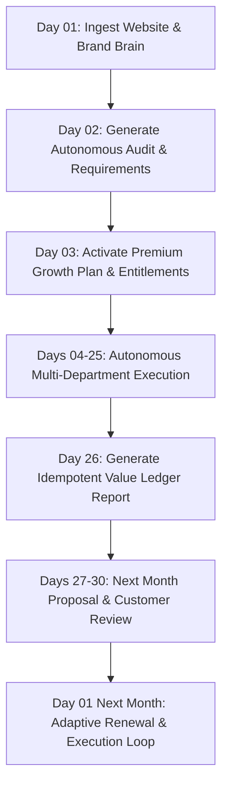

# StratXcel Dogfood Test Plan: Month-Long Autonomous Growth Operation

**Document Purpose**: Full operational protocol for the 1-calendar-month autonomous dogfood test where **StratXcel uses StratXcel to grow StratXcel**.  
**Date**: 2026-08-16  
**Auditor**: StratXcel Autonomous Growth OS Product & Engineering Auditor  

---

## 1. Dogfood Operational Parameters

- **Target Business**: StratXcel Technologies (`https://www.stratxcel.in`)
- **Execution Engine**: Hermes v0.20.0 (Reasoning) + WorkforceCore (25 Specialist Departments)
- **Customer Interface**: WhatsApp Customer Copilot (`packages/whatsapp/`)
- **Accounting Engine**: Value Ledger (`lib/reporting/value-ledger.ts`)
- **Billing Lifecycle**: Calendar Month (1st $\to$ End of Month, Day 26 Value Report)
- **Guiding Principle**: **StratXcel uses its own autonomous AI growth systems to execute its organic marketing, search visibility, content generation, and customer acquisition.**

---

## 2. Advertising & Financial Safety Protocol

To guarantee safety while exercising the platform's advertising strategy capabilities:

### Spend Caps & Financial Limits:
1. **Total Monthly Spend Cap**: ₹5,000 INR (Hard limit)
2. **Per-Day Spend Cap**: ₹250 INR
3. **Per-Campaign Spend Cap**: ₹1,000 INR
4. **Approval Requirement**: Autonomous systems can **read, analyze, recommend, and draft** campaigns; **zero financial spend occurs without explicit human approval** in the StratXcel Approvals Dashboard or WhatsApp Copilot.
5. **Emergency Kill Switch**: Immediate shutdown command `/admin/kill-switch` or WhatsApp Copilot command `HALT ALL MISSIONS`.

---

## 3. Weekly Execution Cadence



### Milestone Schedule:
- **Week 1 (Days 1–7): Foundation & Ingestion**:
  - Run full recursive crawl of `https://www.stratxcel.in`.
  - Extract structured evidence facts into `business_evidence`.
  - Produce initial Baseline Audit Report and prioritized requirements.
- **Week 2 (Days 8–14): Content & Search Visibility**:
  - Dispatch `seo-execution-agent` for technical SEO & Schema markup.
  - Dispatch `content-agent` for product feature articles and social posts.
  - Log deliverable receipts in `value_ledger`.
- **Week 3 (Days 15–21): Lead Capture & Conversion Tuning**:
  - Review conversion funnel metrics from `/app/audit` and `/pricing`.
  - Optimize WhatsApp prompt routing and review generation campaigns.
- **Week 4 (Days 22–30): Monthly Value Reporting & Adaptive Renewal**:
  - **Day 26**: Autonomous compilation of the comprehensive Monthly Value Report.
  - Generate Next Month Growth Plan with transparent pricing delta explanations.
  - Execute automated subscription invoice simulation.

---

## 4. Tracked Metrics & Baseline Inventory

| Metric | Measurement Source | Baseline Target | Month-End Target | Verification Frequency |
| :--- | :--- | :---: | :---: | :--- |
| **Website Health & Page Speed** | Canonical Ingestion Engine | 90+ Score | 95+ Score | Weekly |
| **Search Console Organic Clicks** | Google Search Console API | Baseline | +25% growth | Daily |
| **Search Impressions & Ranking** | Google Search Console API | Baseline | Top 10 for target keywords | Daily |
| **Social Content Delivered** | Value Ledger Receipts | 0 | 16 High-Quality Posts | Real-time |
| **Free Audit Inbound Leads** | Supabase `audit_orders` | Baseline | +50% inbound volume | Daily |
| **AI Compute & Token Cost** | Cost Brain (`lib/commercial/cost-brain.ts`) | Zero | < ₹500 INR internal compute | Daily |
| **Customer-Facing Value Delivered** | Value Ledger Proof of Work | 0 | > ₹35,000 INR commercial equivalent | Day 26 Report |

---

## 5. Dogfood Readiness Verdict

```
+-------------------------------------------------------------------+
|               STRATXCEL DOGFOOD READINESS VERDICT                 |
+-------------------------------------------------------------------+
|  1. Ingestion Engine (Crawler & Fact Extraction)     : READY      |
|  2. Brand Brain & Knowledge Repository               : READY      |
|  3. Requirement & Service Engine                     : READY      |
|  4. Pricing & Plan Engine (Standard/Premium)         : READY      |
|  5. Hermes Reasoning & 21-Specialist Registry        : READY      |
|  6. WorkforceCore 25-Department Execution DAG        : READY      |
|  7. Value Ledger & Monthly Renewal Lifecycle         : READY      |
|  8. WhatsApp Customer Copilot                        : READY      |
|  9. Security, RLS & Tenant Isolation                 : READY      |
| 10. Financial Spend & Kill-Switch Safeguards         : READY      |
+-------------------------------------------------------------------+
|  OVERALL DOGFOOD STATUS: READY FOR OPERATIONAL ACTIVATION         |
+-------------------------------------------------------------------+
```
