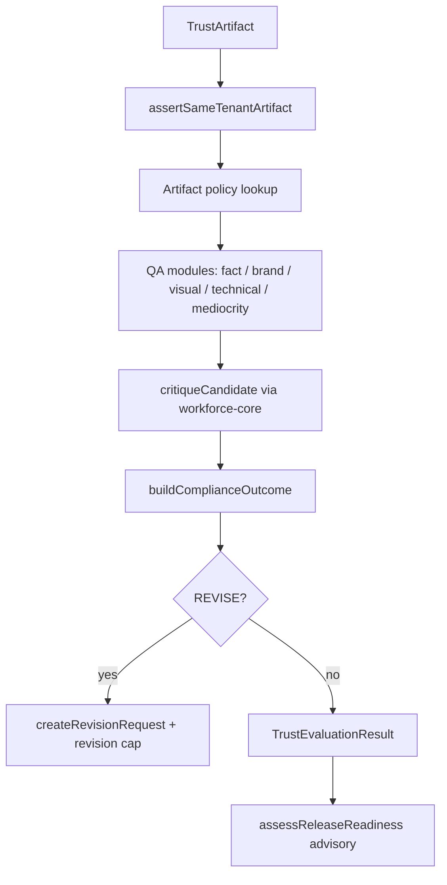

# Trust Department Architecture

The `@stratxcel/trust-department` package implements Quality + Compliance gates that prevent weak, false, off-brand, or unsafe work from reaching customers. It extends `@stratxcel/workforce-core` quality primitives without modifying the capability registry.

## Core invariants

| Invariant | Meaning |
|-----------|---------|
| GENERATED ≠ APPROVED | Model output is never treated as customer-ready without independent review |
| HIGH CREATIVITY ≠ FACTUALLY SAFE | High originality cannot compensate for low factuality when hard gates apply |
| MODEL CONFIDENCE ≠ QUALITY | `modelConfidence` on artifacts is ignored for scoring and release decisions |
| Quality PASS ≠ publish | Passing quality critique does not authorize publish |
| Compliance BLOCK is absolute | Customer or internal approval cannot bypass a compliance hard block |
| Capabilities only narrow | Approvals and handoffs may narrow capabilities, never widen them |

## Package layout

```
packages/trust-department/src/
├── types.ts                 # TrustArtifact, ComplianceOutcome, RevisionRequest, ReleaseReadiness
├── policies/artifact-policies.ts
├── roles/reviewers.ts       # Registry-backed reviewer assignments
├── qa/                        # Specialized QA modules
│   ├── fact-claim.ts
│   ├── brand.ts
│   ├── visual.ts
│   └── technical.ts
├── compliance/outcomes.ts     # PASS | BLOCK | REVISE | HUMAN_REVIEW (+ reason codes)
├── quality/
│   ├── evaluate.ts            # Orchestration + customer approval guards
│   └── revision.ts            # Structured revision requests + cap enforcement
├── release/readiness.ts       # Advisory readiness — does not execute publish
├── audit/claim-guard.ts       # Rejects generic unsupported claims
├── creative/mediocrity-gate.ts
└── index.ts
```

## Reviewer roles (workforce-core registry)

| Registry key | Purpose |
|--------------|---------|
| `quality.creative_critic` | Creative quality and mediocrity gate |
| `quality.final_reviewer` | Final independent review before release readiness |
| `quality.visual_qa` | Visual defect detection |
| `compliance.claim_checker` | Factual claims and evidence |
| `compliance.policy_checker` | Policy violations |
| `compliance.brand_rule_checker` | Brand rule compliance |
| `engineering.reliability_reviewer` | Technical reliability QA |

Creators cannot be sole reviewers (`assertIndependentReviewer`).

## Evaluation flow



## Compliance outcomes

- Decisions: `PASS`, `BLOCK`, `REVISE`, `HUMAN_REVIEW`
- Each outcome carries structured `reasonCodes` (e.g. `prohibited_claim`, `missing_evidence`, `brand_violation`, `visual_defect`, `unsupported_claim`, `mediocrity`)
- `legalCertification` is always `false` — this department never grants legal certification

## Release readiness

`assessReleaseReadiness` returns an advisory `ReleaseReadiness` object:

- Requires quality PASS, compliance PASS, version match, and independent final review
- Sets `readyToRelease` when all gates pass
- Always sets `publishAuthorized: false` — actual publish must occur in a separate governed executor

## workforce-core integration

Uses:

- `defaultQualityPolicy` / `QualityPolicy` — extended per artifact kind in `artifact-policies.ts`
- `critiqueCandidate` — quality scoring with hard gates for factuality, evidence, compliance
- `assertSameTenantArtifact` — cross-tenant rejection
- `getRole`, `roleRegistryKey` — reviewer validation
- `narrowCapabilityClasses`, `CapabilityEscalationError` — customer approval capability narrowing

Hard gates from workforce-core (`factuality`, `compliance`, `evidence_quality`) are preserved and extended with trust-specific dimensions (`visual_quality`, `technical_quality`).

## Testing

```bash
node --experimental-strip-types packages/trust-department/src/__tests__/trust-department.test.ts
node --experimental-strip-types packages/workforce-core/src/__tests__/quality.test.ts
```

Tests cover hard blocks, revision structure, revision caps, version matching, approval bypass prevention, cross-tenant rejection, unsupported claim audit, release readiness accuracy, technical QA, and creative mediocrity rejection.
